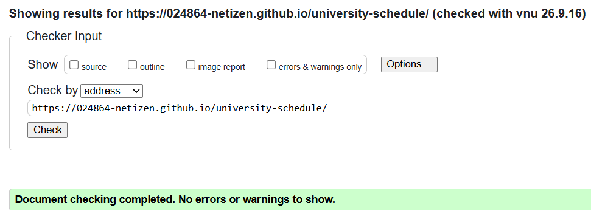
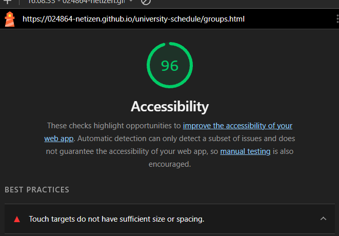

# Лабораторна робота №2

## Семантична розмітка та форми: каркас вебзастосунку

### Мета роботи

Створити семантичну структуру вебзастосунку, додати навігацію, розклад, форму зворотного зв'язку та перевірити доступність сторінок.

### Посилання

GitHub: https://github.com/024864-netizen/university-schedule

Сайт: https://024864-netizen.github.io/university-schedule/

Сторінки проєкту:

- Головна: https://024864-netizen.github.io/university-schedule/

- Розклад: https://024864-netizen.github.io/university-schedule/schedule.html

- Групи та форма: https://024864-netizen.github.io/university-schedule/groups.html

### Виконання роботи

Було створено три сторінки: головну, сторінку з розкладом та сторінку з навчальними групами і формою.

Для структури сторінок використано header, nav, main, section та footer. Заголовки розташовані в логічному порядку.

На сторінці розкладу додано таблицю з часом, дисциплінами, викладачами та аудиторіями. Для таблиці використано caption і scope.

Також додано зображення з атрибутом alt.

### Форма

На сторінці groups.html створено форму зворотного зв'язку.

У формі є поля для імені, email, номера телефону, вибору групи, дати та повідомлення.

Для полів використано label, а форму поділено за допомогою fieldset і legend.

Додано перевірку required, minlength та pattern. Номер телефону перевіряється у форматі +380XXXXXXXXX.

При спробі відправити порожню форму браузер показує повідомлення про необхідність заповнення обов'язкових полів.

### Перевірка

Усі три сторінки перевірено через HTML Validator. Помилок і попереджень не виявлено.

Також виконано перевірку навігації за допомогою клавіші Tab. Інтерактивні елементи доступні для переходу з клавіатури.

Для автоматичної перевірки доступності використано Lighthouse. Результат Accessibility — 96/100. Lighthouse показав рекомендацію щодо розміру та відстані між touch targets.

### Висновок

У результаті було створено семантичні сторінки вебзастосунку, таблицю розкладу та форму з браузерною валідацією. Проведено перевірку HTML та базової доступності сайту.

