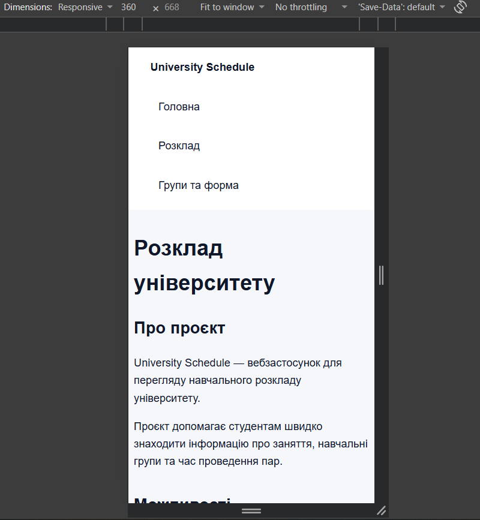
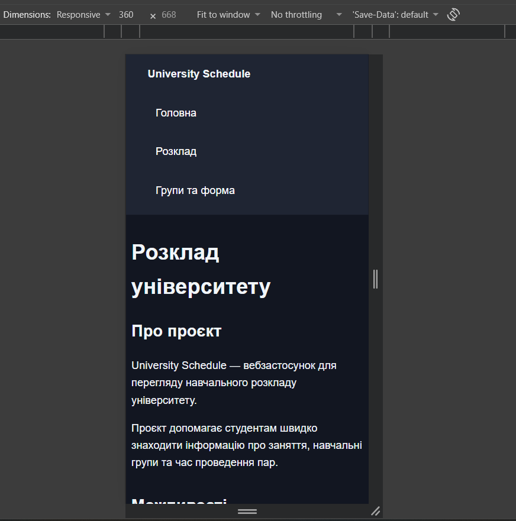
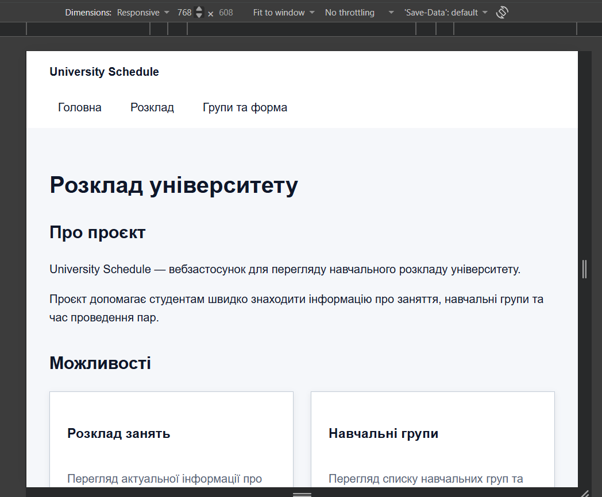
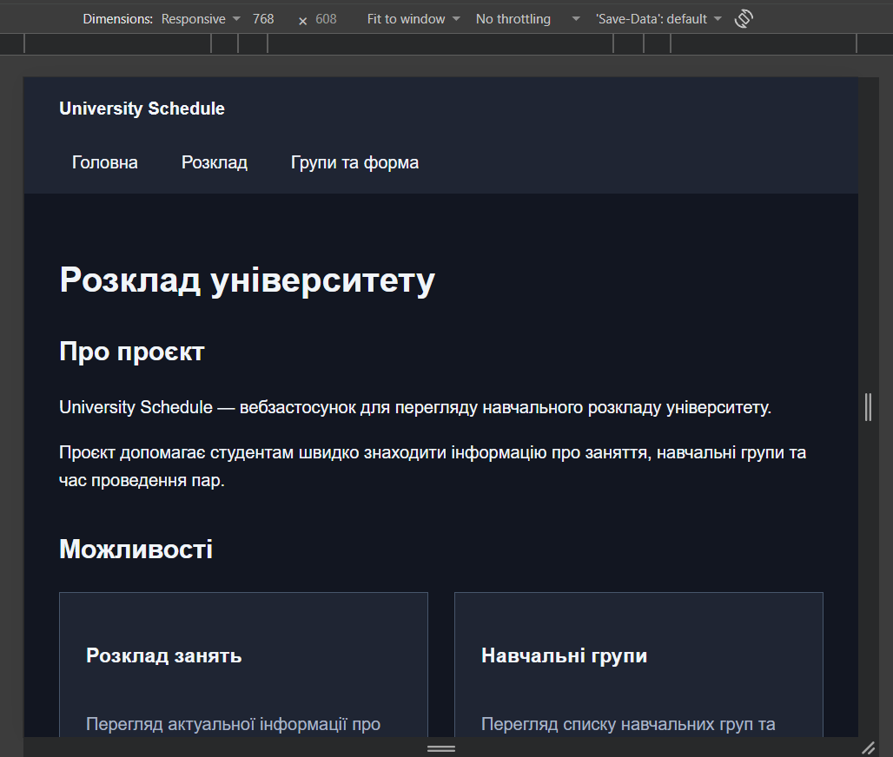
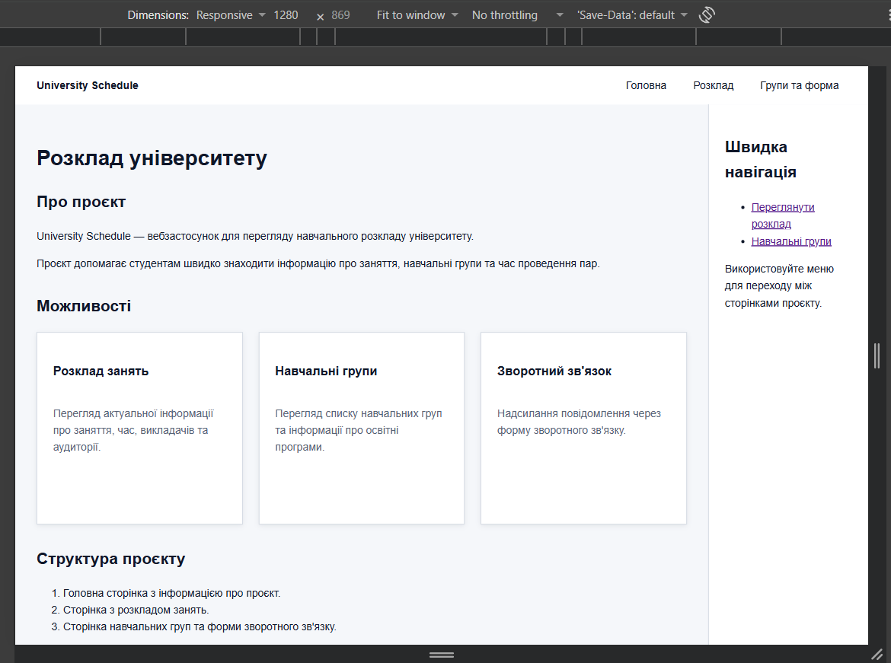
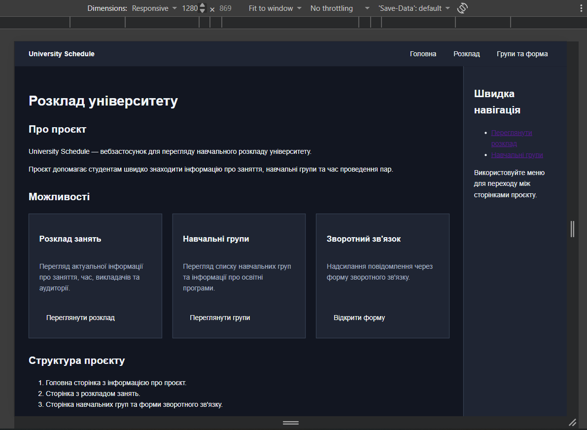

\# Лабораторна робота №4

Адаптивність і дизайн-система проєкту.

\## Виконання

У проєкті створено окремий файл `tokens.css`, у якому зберігаються дизайн-токени для кольорів, відступів, радіусів, розмірів шрифту, міжрядкового інтервалу та тіней. Для побудови палітри використано HSL зі шкалою основного синього кольору, акцентом і нейтральними кольорами.

Адаптивність реалізовано для контрольних ширин 360, 768 і 1280 px. Для різних розмірів екрана використано media queries, гнучкі одиниці та функцію `clamp()` для типографіки. На вузьких екранах картки переходять в одну колонку, а sidebar розташовується під основним контентом.

Темну тему реалізовано через `@media (prefers-color-scheme: dark)`. У темній темі змінюються значення CSS-токенів, тому окремо переписувати компоненти не потрібно.

Для тексту задано розміри шрифту, міжрядковий інтервал і обмеження ширини основного контенту для кращої читабельності.

Контраст основного тексту, приглушеного тексту, кнопок і меж полів було перевірено для світлої та темної тем. Значення контрасту відповідають вимогам WCAG для основного тексту та елементів інтерфейсу.

\## Посилання

Репозиторій: https://github.com/024864-netizen/university-schedule

Опублікований сайт: https://024864-netizen.github.io/university-schedule/

\## Висновок

У результаті роботи створено дизайн-систему на основі CSS-токенів, реалізовано адаптивність для трьох контрольних ширин і автоматичну темну тему. Також налаштовано типографіку та перевірено контраст основних елементів інтерфейсу.

## Скріншоти

### 360 px

### 768 px

### 1280 px

