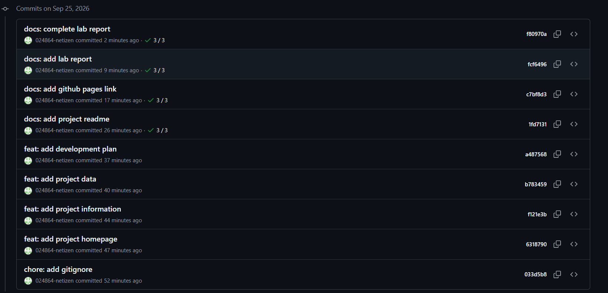

\# Звіт до лабораторної роботи №1

\## Тема

Середовище розробки,Git і перша сторінка проєкту.

\## Мета роботи

Налаштувати середовище веброзробки,ознайомитися з основними командами Git, створити перший вебпроєкт та опублікувати його за допомогою GitHub Pages.

\## 1. Налаштування середовища

У процесі виконання лабораторної роботи було перевірено встановлення необхідних інструментів.

Версії встановлених програм:

Node.js: v24.21.0

npm: 11.9.0

Git: 2.54.0.windows.1

Також було налаштовано ім'я та електронну адресу користувача Git.

\## 2. Створення GitHub-репозиторію

Було створено публічний репозиторій:

https://github.com/024864-netizen/university-schedule

Для роботи з репозиторієм його було клоновано локально за допомогою Git.

\## 3. Створення вебсторінки

Було створено файл `index.html`.

Сторінка містить:

\- заголовок сторінки;

\- опис проєкту;

\- список запланованих можливостей;

\- інформацію про проєкт;

\- перелік основних сутностей даних;

\- план розвитку проєкту.

У HTML-документі використано `lang="uk"`, кодування UTF-8 та meta viewport.

\## 4. Git та історія змін

Під час виконання роботи було створено декілька осмислених комітів:

1\. `chore: add gitignore`

2\. `feat: add project homepage`

3\. `feat: add project information`

4\. `feat: add project data`

5\. `feat: add development plan`

6\. `docs: add project readme`

7\. `docs: add github pages link`

### Скриншот історії комітів

\## 5. GitHub Pages

Проєкт було опубліковано за допомогою GitHub Pages.

Посилання на опубліковану сторінку:

https://024864-netizen.github.io/university-schedule/

Сторінка успішно відкривається у браузері.

\## 6. README

У репозиторії створено файл `README.md`, який містить:

\- опис предметної області;

\- мету проєкту;

\- основні сутності даних;

\- план розвитку;

\- посилання на опубліковану сторінку;

\- інструкцію локального запуску;

\- перелік використаних технологій.

\## 7. Труднощі та їх вирішення

Під час виконання лабораторної роботи виникли труднощі з початковим налаштуванням Git та підключенням локального репозиторію до GitHub.

Проблему було вирішено шляхом перевірки налаштувань Git, клонування правильного GitHub-репозиторію та налаштування віддаленої гілки `origin/main`.

Також було налаштовано GitHub Pages для публікації вебсторінки.

\## Висновок

У ході лабораторної роботи було налаштовано середовище веброзробки, створено GitHub-репозиторій, виконано базові операції з Git, створено першу HTML-сторінку та опубліковано її за допомогою GitHub Pages.

